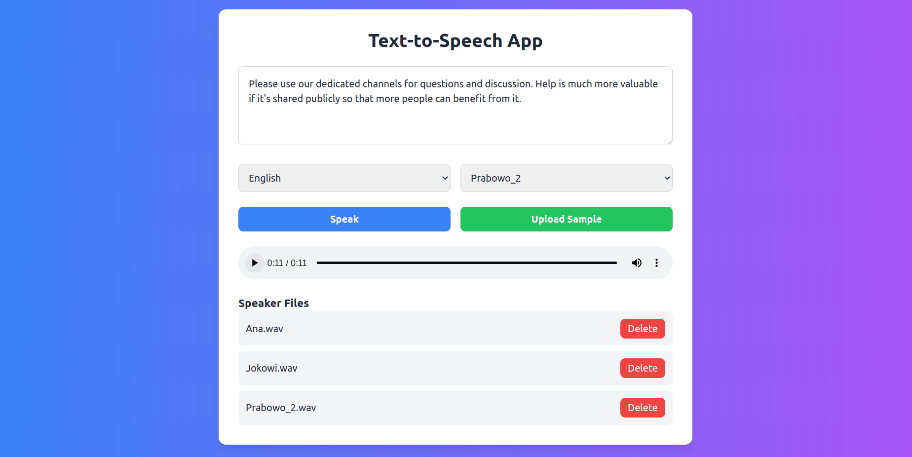
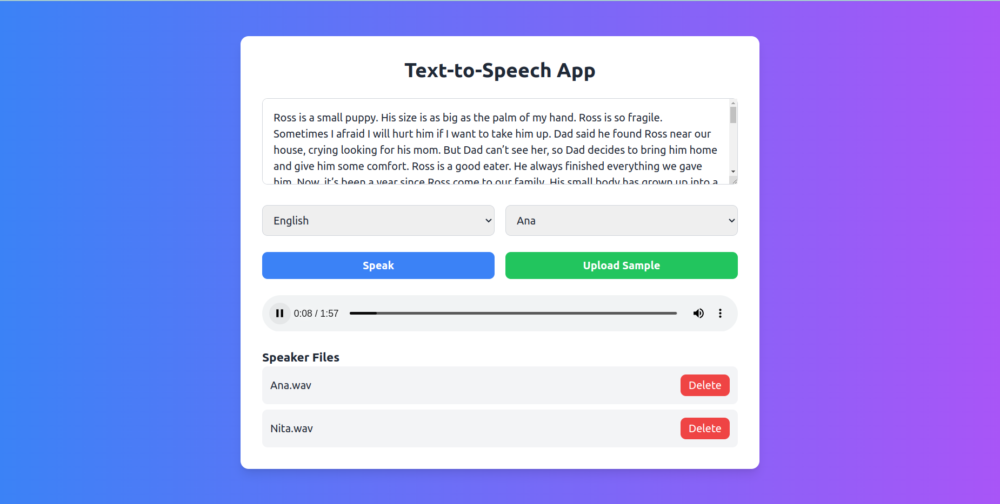
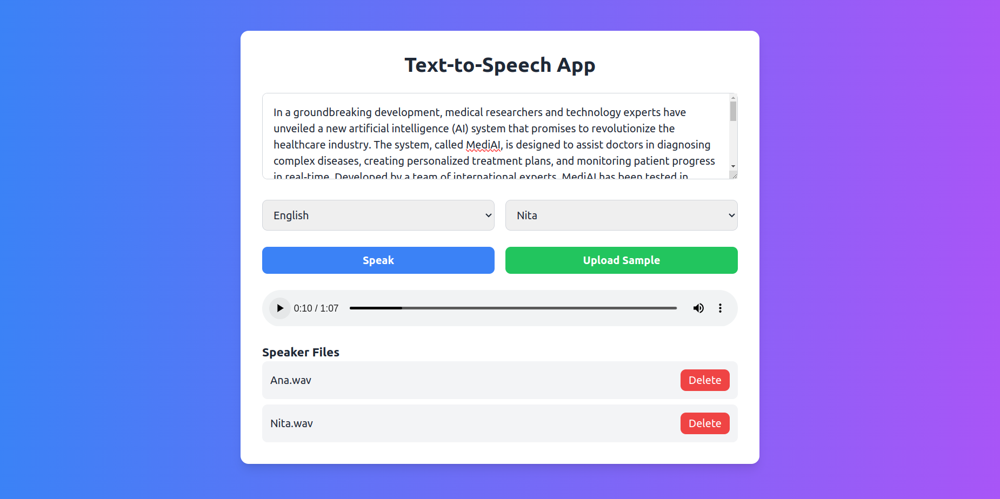

---

# 🐸Coqui.ai - Text to Speech (TTS)

### 📰 Latest Updates
- **ⓍTTSv2**: Now supports 16 languages with improved performance.
- **Fine-Tuning**: The fine-tuning code for ⓍTTS is out. Check out the [example recipes](https://github.com/coqui-ai/TTS/tree/dev/recipes/ljspeech).
- **Low Latency**: ⓍTTS can now stream with less than 200ms latency.
- **🐶 Bark**: Now available for inference with unconstrained voice cloning. [Docs](https://tts.readthedocs.io/en/dev/models/bark.html).
- **Integration with Fairseq Models**: You can now use over **1100 Fairseq models** for TTS.
- **🐢 Tortoise**: TTS now supports Tortoise for faster inference. [Docs](https://tts.readthedocs.io/en/dev/models/tortoise.html).





### 🥇 TTS Performance Overview
- High-performance models for Text-to-Speech tasks, including popular architectures like Tacotron, Glow-TTS, VITS, and more.
- Multi-speaker and multilingual support with state-of-the-art synthesis quality.

### Key Features
- **Models**: Includes Tacotron, Glow-TTS, VITS, Tortoise, Bark, and more.
- **Efficient Training**: Tools for easy model training and fine-tuning.
- **Multi-Speaker & Multi-Language**: Support for both single and multi-speaker synthesis, as well as multi-language support.
- **Real-Time Streaming**: <200ms latency for streaming.
- **Pre-trained Models**: Ready-to-use models for different languages and voices.

### Installation

For synthesizing speech:
```bash
pip install TTS
```

For development or model training:
```bash
git clone https://github.com/coqui-ai/TTS
pip install -e .[all,dev,notebooks]
```

### Running the WebUI

1. Navigate to the frontend directory:
   ```bash
   cd frontend
   ```

2. Start the development server:
   ```bash
   npm start
   ```
   Open [http://localhost:3000](http://localhost:3000) in your browser to access the WebUI.

3. Run tests:
   ```bash
   npm test
   ```

4. Build the app:
   ```bash
   npm run build
   ```

### TTS Usage Example

#### Python API - Multi-Speaker and Multi-Lingual TTS:
```python
import torch
from TTS.api import TTS

device = "cuda" if torch.cuda.is_available() else "cpu"

# Initialize the model
tts = TTS("tts_models/multilingual/multi-dataset/xtts_v2").to(device)

# Run TTS
wav = tts.tts(text="Hello world!", speaker_wav="my/cloning/audio.wav", language="en")
```

#### Voice Conversion Example:
```python
tts = TTS(model_name="voice_conversion_models/multilingual/vctk/freevc24", progress_bar=False).to("cuda")
tts.voice_conversion_to_file(source_wav="my/source.wav", target_wav="my/target.wav", file_path="output.wav")
```

#### Run TTS from Command Line:
```bash
$ tts --text "Text for TTS" --out_path output/path/speech.wav
```

For more options, such as voice cloning, multi-speaker models, and advanced settings, check the command-line documentation.

---

